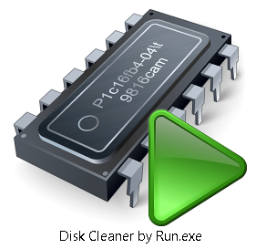
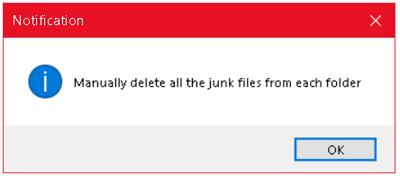
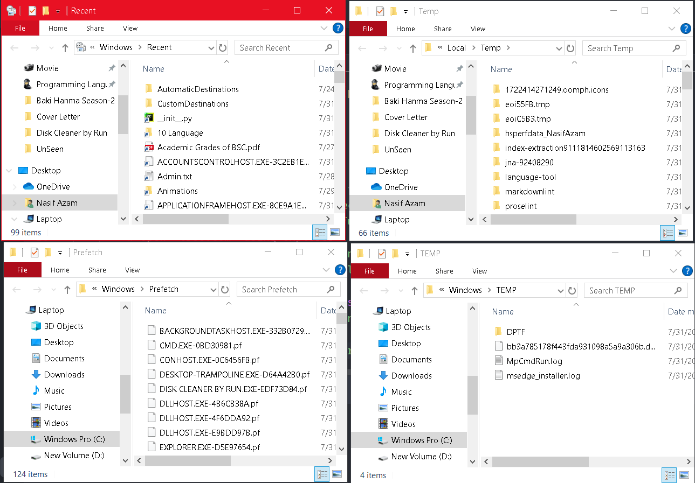
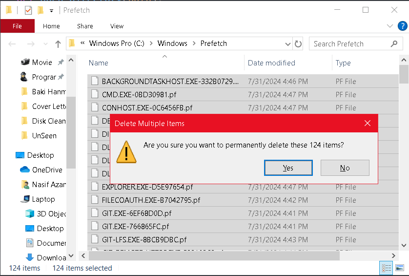

<h1 align="center">Disk Cleaner Using Python Shell</h1>

A disk cleaner application in real life helps manage and optimize your computer's storage by removing unnecessary files. A real-life software is CCleaner. CCleaner is a popular disk cleaner and system optimization tool developed by Piriform. It provides a comprehensive suite of features designed to clean up temporary files, manage system performance, and protect user privacy.

## Usages
- System Cleanup
- Registry Cleaner
- Disk Analyzer
- Secure File Deletion

## Implementation

  
   
  <em>Figure 1: Double-click the Disk Cleaner</em>

  
   
  <em>Figure 2: Delete All Junk Files</em>

  
   
  <em>Figure 3: Four Unwanted Files  Directories</em>

  
   
  <em>Figure 4: Select All & Perform Deletion</em>

